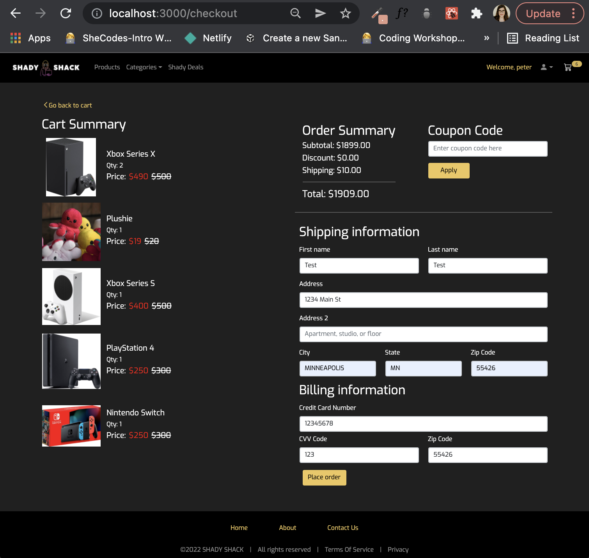
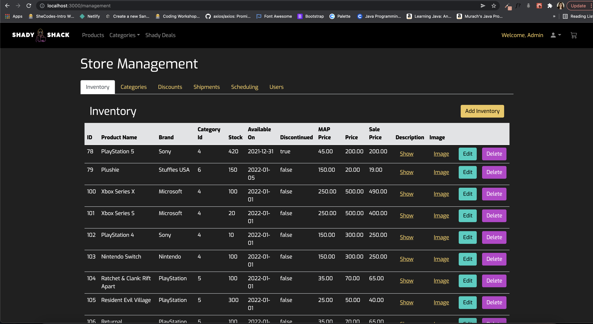
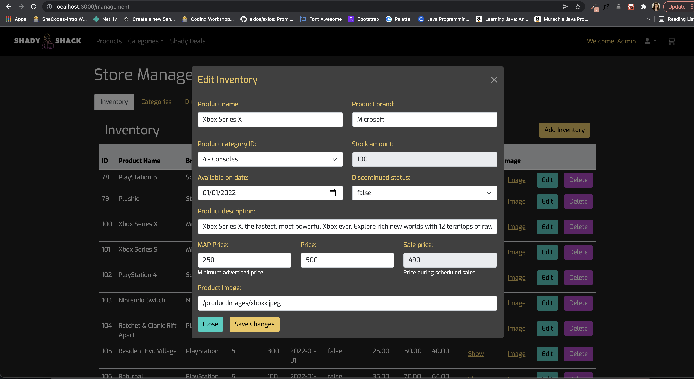

## Welcome to Shady Shack!

As members of York Solution's [Barriers To Entry Program](https://yorksolutions.net/b2e-career-seekers/ "Barriers To Entry"), 
we were deemed to create 
an ecommerce application, focusing on JavaScript, React, Java, and Spring Boot. 
Within hours, our focus aligned, and Shady Shack was born. 

Between December 22, 2021 and January 13, 2022, 
we started with a `create-react-app bbfs21-team-2`, which has grown into what you see here.
We are proud to show off the progress of our combined organizational and coding skills, 
whether they have been developed as recently as in the last 8 weeks, over time within 
a formal educational or professional setting, or by using 
one of the plentiful resources on the world wide web.

We hope you enjoy the results of our effort and teamwork!

### Home Page

### Payment Page Example

### Products Page Example

### Storeback Page Example

### Storeback Edit Page Example

### Description:

This application will support a small online only business keep track of its inventory and serve its customers.

There are three types of users:

1. Administrators,
2. Shopkeepers, and
3. Customers.

- Administrators need to be able to manage all types of user accounts.
- Shopkeepers must be able to manage all aspects of inventory, sales, and order fulfillment.
- Customers must be able to place orders as guests, or with a customer account.

<pre></pre>

### Requirements:

- [x] Your code shall be pushed to GitHub under the York account
- [x] The repository shall be named ‘bbfs21-team-#’

>
An administrator user shall be able to:

- [x] Create/Edit/Delete all user accounts except for deleting or deescalating their own account

>
A shopkeeper user shall be able to:

- [x] Create/Edit/Delete product categories
- [x] Create/Edit/Delete inventory
- [x] Create/Edit/Delete coupon codes with start/stop dates and use limits

View errors/warnings:

- [x] An item is selling for a loss
- [x] An item is advertised at a lower price than MAP

>
A customer shall be able to:

View all available inventory with:

- [x] Current price
- [x] Current sale
- [x] Description
- [x] Discontinued status
- [x] Categories
- [x] Add any available inventory to their cart
- [x] View/Edit/Delete items in their cart
- [x] View total cost of their cart
- [x] “Check out” (DO NOT ASK FOR PAYMENT OR IDENTIFYING INFORMATION. DO NOT CONNECT THIS APPLICATION TO A PAYMENT
  PROCESSOR OF ANY KIND. THIS IS A FAKE CHECKOUT.)
- [x] Create/Edit/Delete their account
- [x] Email
- [x] Password
- [x] View past orders and their current cart if they are signed in to their account

>
Each inventory entry shall track:

- [x] Scheduled minimum advertised prices (each MAP shall have an effective on date)
- [x] Scheduled Prices (each Price shall have an effective on date)
- [x] Scheduled Sales (each Sale shall have an effective on date)
- [x] Description
- [x] Images
- [x] Quantities at cost (not all shipments cost the same)
- [x] Discontinued status
- [x] Available on date
- [x] Categories

## Planning

The following links cover the various tools we used to plan and execute Shady Shack.

- [Figma Flow Chart](https://www.figma.com/file/fnxB5VJSMJW8oAgv8eL6Gp/Customer-Flow?node-id=0%3A1 "Figma Flow Chart")

- [Database Diagram](https://dbdiagram.io/embed/61c4ad343205b45b73cab5ed "Database Diagram")

- [Figma Wireframes](https://www.figma.com/file/xQe5MrZYSpIYaG3VFB8LW1/Team-2-Customer-UI-Wireframe?node-id=0%3A1 "Figma Wireframes")

- [Jira](https://yorksolutionsb2e.atlassian.net/jira/software/projects/T2ORS/boards/96/roadmap "Shady Shack Jira Board")

- [GitHub Repository](https://github.com/York-Solutions-B2E/bbfs21-team-2 "Github Repository")

- [Bugs](https://github.com/York-Solutions-B2E/bbfs21-team-2/issues "Issues Page")

- [Daily Meeting Notes](https://docs.google.com/spreadsheets/d/1M5GP3iFzy1ufkNNQXIRJk47RPb8-LjuYf2ZV0Qb-KXg/edit#gid=0 "Issues Page")

- [Discord](https://www.discord.com "Discord")

- [Zoom](https://www.zoom.com "Zoom")

Planning also included creating teams that focused on frontend, backend, or edge case groups. Multiple
meetings, including 9am weekday stand-ups, were crucial to the beginning stages. Overall, members were able and
encouraged to move between front and backend code development.

[comment]: <> (## Architecture of Code)

[comment]: <> (Minimum Viable Product)

[comment]: <> (Redux)

[comment]: <> (Micro-Services)

[comment]: <> (Etc.)

[comment]: <> (Autowired annotation)

[comment]: <> (We could get instances of a product controller)

[comment]: <> (price period controller)

[comment]: <> (needs to when you change a price and the date was now)

[comment]: <> (so it needs to tell the product controller)

[comment]: <> (but the method belongs to the product controller)

[comment]: <> (use an instance of the product controller and use its methods)

[comment]: <> (so you instantiate like you do in java but the problem is)

[comment]: <> (1. they could interact poorly)

[comment]: <> (2. there is one product controller and autowired keeps it all organized.)

[comment]: <> (autowired reference vs instance)

[comment]: <> (loosely coupled)

[comment]: <> (take the product controller and bring it into the method)

[comment]: <> (Etc.)

## UI

We decided to stick to a simple, dynamic color scheme, and implement a majority of our styling
with [React-Bootstrap](https://react-bootstrap.github.io/), [Sass](https://sass-lang.com/), and basic 
[CSS](https://developer.mozilla.org/en-US/docs/Web/CSS). We also checked out other ecommerce sites and took 
notes about what we liked, what we thought we could implement, and what would also reach MVP. A few examples 
we referred to are 
[Allbirds](https://www.allbirds.com/), [Bombas](https://www.bombas.com), and [Razer](https://www.razer.com/).

## Built With

- JavaScript
- React
- Java
- Spring Boot
- H2 Database
- Bootstrap
- CSS
- HTML
- NPM

We used IntelliJ as our IDE, and for our web browser we used the latest version of 
Google Chrome as of January 13, 2022.

## The Hopes & Dreams of a Future Shady Shack 2.0

- [ ] Improved database storage reliability
- [ ] Show multiple images of each product
- [ ] Include 'available on' date information on upcoming products
- [ ] Include JUnit testing
- [ ] Expand category and product selection
- [ ] Expand shopkeeper edit abilities to home page cards and Shady Deal of the Day

## 💻 Authors

- [Adam Kasper](https://github.com/adamgkasper "Adam Kasper")
- [Allison Maurer](https://github.com/allisonmrr "Allison Maurer")
- [Chi Keng Lee](https://github.com/CKlee0114 "Chi Keng Lee")
- [Chua Moua](https://github.com/cmoua051 "Chua Moua")
- [Cleo Romain](https://github.com/cleoromain "Cleo Romain")
- [Darian Thao](https://github.com/darianthao "Darian Thao")
- [Jacob Ukkelberg](https://github.com/jacobukk "Jacob Ukkelberg")
- [Jessica Woudsma](https://github.com/jssckbl "Jessica Woudsma")
- [Nathaniel Bahn](https://github.com/NateBahn "Nathaniel Bahn")
- [Peter Phenow](https://github.com/peterphenow "Peter Phenow")
- [Yansen Hadiwikarsa](https://github.com/Yansen-Hadiwikarsa "Yansen Hadiwikarsa")

## 😎 A Big Shady Thank You To

- [Madison Fortenberry](https://github.com/mfortenberry "Madison Fortenberry") 

- [Corey Burns](https://github.com/empresscor07 "Corey Burns")

## 🤝 Support

Contributions, issues, and feature requests are welcome!

